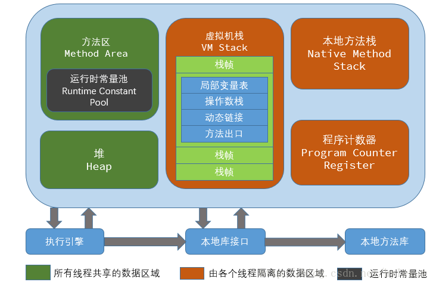
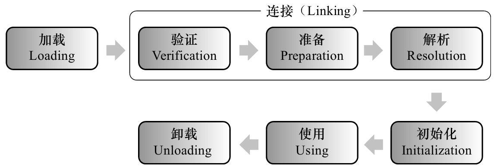
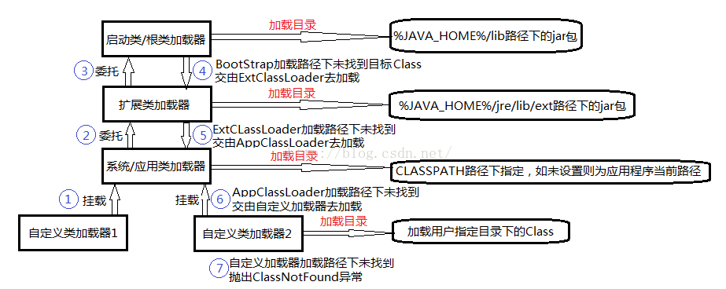

# Java基础学习笔记之JVM

## 前言

参考文献：<https://docs.oracle.com/javase/specs/index.html>

##  基本概念：

JVM 是可运行 Java 代码的假想计算机，包括一套字节码指令集、一组寄存器、一个虚拟机栈、一个本地方栈、一个堆和一个存储方法区。JVM 是运行在操作系统之上，没有和硬件直接交互。

## JVM 组成



* **堆**（数组，对象）：是被线程共享的一块内存区域，创建的对象和数组都保存在Java 堆内存中，也是垃圾收集器进行
  垃圾收集的最重要的内存区域。由于现代VM 采用分代收集算法, 因此Java 堆从GC 的角度还可以
  细分为: 新生代(Eden 区、From Survivor 区和To Survivor 区)和老年代。
* **方法区**（类信息、常量、静态变量，实例，常量池）：用于存储被JVM 加载的类信息、常量、静态变量、即时编译器编译后的代码等数据.
* **虚拟机栈**：是描述java方法执行的内存模型，每个方法在执行的同时都会创建一个栈帧（Stack Frame）用于存储局部变量表、操作数栈、动态链接、方法出口等信息。每一个方法从调用直至执行完成的过程，就对应着一个栈帧在虚拟机栈中入栈到出栈的过程。
* **本地方法栈**：本地方法区和虚拟机栈作用类似, 区别是虚拟机栈为执行Java 方法服务, 而本地方法栈则为
  Native 方法服务。
* **程序计数器**：一块较小的内存空间, 是当前线程所执行的字节码的行号指示器，每条线程都要有一个独立的程序计数器，这类内存也称为“线程私有”的内存。

## 为什么研究类加载全过程

> * 有助于了解 JVM 运行过程
> * 更深入了解 Java 动态性（比如热部署、动态加载），提高程序的灵活性

## 类加载过程



* **加载：**加载过程时，将类的信息加载到方法区中，同时在堆上生成对应的 java.lang.Class 对象，作为方法区的入口

* **验证** 这一阶段的主要目的是为了确保Class文件的字节流中包含的信息是否符合当前虚拟机的要求，并且不会危害虚拟机自身的安全。

* **准备** 准备阶段是正式为类变量分配内存并设置类变量的初始值阶段，即在方法区中分配这些变量所使用的内存空间。注意这里所说的初始值概念，

* **解析** 解析阶段是指虚拟机将常量池中的符号引用替换为直接引用的过程。

* **初始化** 初始化阶段是类加载最后一个阶段，前面的类加载阶段之后，除了在加载阶段可以自定义类加载器以外，其它操作都由JVM主导。到了初始阶段，才开始真正执行类中定义的Java程序代码。

  初始化阶段是执行类构造器的过程，当初始化一个类的时候，如果发现其父类没有进行初始化，则先初始化父类，虚拟机会保证一个类的构造方法在多线程环境中被正确加锁和同步。

  **类只初始化一次**

  ## 初始化顺序

  1. 父类静态域
  2. 子类静态域
  3. 父类普通域
  4. 父类构造方法
  5. 子类普通域
  6. 子类构造方法

  > 初始化分为主动引用（一定发生类初始化）和被动引用（不会发生类初始化）
  >
  > 主动引用
  >
  > 1. new 一个对象
  > 2. 调用类的静态成员（除了常量）和静态方法
  > 3. 初始化一个类，先初始化父类
  >
  > 被动引用
  >
  > 1. 访问父类的静态域，不会初始化子类
  > 2. 通过数组定义类引用，不会触发此类的初始化
  > 3. 引用常量不会触发类的初始化
  >
  > 

## 类加载器

* 启动类加载器(Bootstrap ClassLoader) 

  > 负责加载 JAVA_HOME\lib 目录中的，或通过 -Xbootclasspath 参数指定路径中的，且被虚拟机认可（按文件名识别，如rt.jar）的类。并不继承 java.lang.ClassLoader 

* 扩展类加载器(Extension ClassLoader) 

  > 负责加载 JAVA_HOME\lib\ext 目录中的，或通过 java.ext.dirs 系统变量指定路径中的类库。

* 应用程序类加载器(Application ClassLoader)： 

  > 负责加载用户路径（classpath）上的类库。 JVM 通过双亲委派模型进行类的加载，当然我们也可以通过继承 java.lang.ClassLoader 实现自定义的类加载器。



## 双亲委派

 当一个类收到了类加载请求，他首先不会尝试自己去加载这个类，而是把这个请求委派给父类去完成，每一个层次类加载器都是如此，因此所有的加载请求都应该传送到启动类加载其中，只有当父类加载器反馈自己无法完成这个请求的时候（在它的加载路径下没有找到所需加载的Class），子类加载器才会尝试自己去加载。 采用双亲委派的一个好处是比如加载位于rt.jar包中的类java.lang.Object，不管是哪个加载器加载这个类，最终都是委托给顶层的启动类加载器进行加载，这样就保证了使用不同的类加载器最终得到的都是同样一个Object对象。

## 线程类加载器

线程类加载器是为了抛弃双亲委派加载链模式

每个线程都有一个关联的上下文类加载器。如果使用 new Thread() 方法生成一个新的线程，新线程将继承其父线程的上下文类加载器。如果程序对线程上下文类加载器没有做任何改变，程序中所有的线程将都使用系统类加载器作为上下文类加载器。

Thread.currentThread().getContextClassLoader();

Thread.currentThread().setContextClassLoader();

## JVM 线程

Hotspot JVM 后台运行的系统线程主要有下面几个：

| 线程           | 描述                                                         |
| -------------- | ------------------------------------------------------------ |
| 虚拟机线程     | 这个线程等待 JVM 到达安全点操作出现。这些操作必须要在独立的线程里执行，因为当<br/>堆修改无法进行时，线程都需要 JVM 位于安全点。这些操作的类型有：stop-theworld<br/>垃圾回收、线程栈 dump、线程暂停、线程偏向锁（biased locking）解除。 |
| 周期性任务线程 | 这线程负责定时器事件（也就是中断），用来调度周期性操作的执行。 |
| GC 线程        | 这些线程支持 JVM 中不同的垃圾回收活动。                      |
| 编译器线程     | 这些线程在运行时将字节码动态编译成本地平台相关的机器码。     |
| 信号分发线程   | 这个线程接收发送到 JVM 的信号并调用适当的 JVM 方法处理。     |

## 自定义实现类加载器

```java
package top.simba1949;

import java.io.*;

/**
 * 自定义文件系统类加载器
 * 1. 继承 ClassLoader
 * 2. 委托父类加载，父类加载不到自己加载
 *
 * @author SIMBA1949
 * @date 2019/6/4 21:54
 */
public class FileSystemClassLoader extends ClassLoader{

	private String rootDir;

	public FileSystemClassLoader(String rootDir) {
		this.rootDir = rootDir;
	}

	@Override
	protected Class<?> findClass(String name) throws ClassNotFoundException {
		Class<?> loadedClass = findLoadedClass(name);
		// 判断是否加载
		if (loadedClass == null){
			ClassLoader parent = this.getParent();
			try {
				// 委托父类加载
				loadedClass = parent.loadClass(name);
			} catch (ClassNotFoundException e) {
				e.printStackTrace();
			}
			
			if (loadedClass == null){
				// 父类加载不到，自己加载
				byte[] classData = getClassData(name);
				if (classData == null){
					throw new ClassNotFoundException();
				}else {
					// 将类的字节数组，定义一个类
					loadedClass = defineClass(name, classData, 0, classData.length);
				}
			}
		}
		return loadedClass;
	}

	private byte[] getClassData(String classname) {
		String path = rootDir + "/" + classname.replace(".", "/") + ".class";
		FileInputStream fis = null;
		ByteArrayOutputStream baos = new ByteArrayOutputStream();

		try {
			fis = new FileInputStream(new File(path));

			byte[] flush = new byte[1024 * 8];
			int len;
			while ((len = fis.read(flush)) != -1){
				baos.write(flush, 0, len);
			}
			return baos.toByteArray();
		} catch (IOException e){
			return null;
		} finally {
			if (null != baos){
				try {
					baos.close();
				} catch (IOException e) {
					e.printStackTrace();
				}
			}
			if (null != fis){
				try {
					fis.close();
				} catch (IOException e) {
					e.printStackTrace();
				}
			}
		}
	}
}
```


