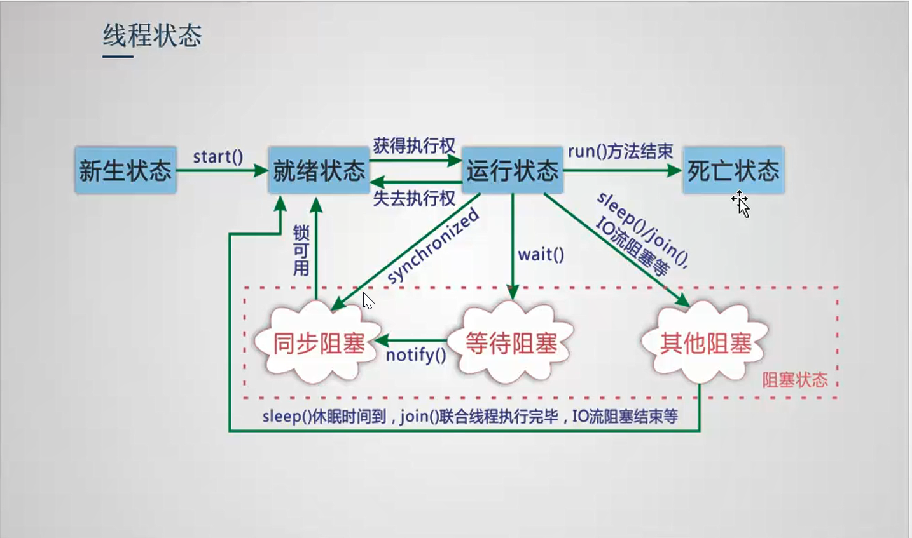

# 多线程

## 程序、进程与线程

> 

## 线程优先级

> 线程优先级分配，优先级高的线程只是获取CPU使用权的概率高，不代表优先级低的线程不执行。
>
> 线程优先级设置需要在调用 start 方法之前设置。
>
> ```
> Thread thread = new Thread();
> // MIN_PRIORITY = 1; NORM_PRIORITY = 5; MAX_PRIORITY = 10;
> thread.setPriority(Thread.NORM_PRIORITY);
> ```

## 实现多线程的四种方式

1. 继承 Thread 类，重写 run 方法，使用 start() 方法开启新线程

   ```java
   public class ExtendThreadLearn extends Thread {
   
       @Override
       public void run() {
           System.out.println(Thread.currentThread().getName() + "多线程实现方式一，继承 Thread， 重写run方法");
       }
   }
   
   class ExtendThreadLearnTest {
       public static void main(String[] args) {
           ExtendThreadLearn td = new ExtendThreadLearn();
           td.start();
       }
   }
   ```

2. 实现 Runnable 接口，重写 run 方法，创建 Thread(Runnable) 对象，使用 Thread 的 start() 方法开启新线程

   ```java
   public class ImplRunnableLearn implements Runnable {
       public void run() {
           System.out.println(Thread.currentThread().getName() + "多线程实现方式二，实现 Runnable 接口，重写run方法");
       }
   }
   
   class ImplRunnableLearnTest {
       public static void main(String[] args) {
           Runnable runnable = new ImplRunnableLearn();
           new Thread(runnable).start();
       }
   }
   ```

3. 实现 Callable 接口（j.u.c包下），基于线程池

   ```java
   public class ImplCallable implements Callable<Object> {
       /**
   	 * 实现 Callable 接口，重写 call 方法
   	 * @return
   	 * @throws Exception
   	 */
       public Object call() throws Exception {
           System.out.println(Thread.currentThread().getName() + "多线程实现方式三：实现 Callable 接口");
           return "SUCCESS";
       }
   }
   
   class ImplCallableTest{
       public static void main(String[] args) throws ExecutionException, InterruptedException {
           // 创建实现 Callable 接口的对象
           ImplCallable implCallable = new ImplCallable();
           // 创建一个线程数为 3 的线程池
           ExecutorService pool = Executors.newFixedThreadPool(3);
           // 提交执行
           Future<Object> result = pool.submit(implCallable);
           // 获取执行结果
           Object o = result.get();
           System.out.println(o.toString());
           // 关闭服务
           pool.shutdown();
       }
   }
   ```

## start 方法调用

> 调用 start 方法并不一定立即执行，有系统分配调度执行
>
> 调用 run 方法，只是相当于调用普通方法，没有开启多线程

## 线程状态



* 新生状态

  > new Thread() 创建线程，该线程进入新生状态

* 就绪状态

  > 1. 新创建的线程调用 start 方法，该线程进入就绪状态
  > 2. 阻塞状态接触，该线程进入就绪状态
  > 3. 调用 yield 方法，该线程进入就绪状态
  > 4. JVM 切换到其他线程，该线程进入就绪状态

* 运行状态

  > 该线程获取 CPU 使用权，该线程进入运行状态

* 死亡状态

  > 线程执行完成，或者中断，该线程进入死亡状态

* 阻塞状态

  > 1. 调用 Thread.Sleep() 方法，该线程进入阻塞状态
  > 2. 调用 Object.wait() 方法，该线程进入阻塞状态
  > 3. 调用 join 方法，该线程进入阻塞状态
  > 4. io读写操作时，该线程进入阻塞状态

  ## 线程停止

  1. 线程中方法执行完成
  2. 通过变量控制线程停止

  Sleep

  > sleep(时间)，指定当前线程阻塞的毫秒数
  >
  > sleep 存在 InterruptedException 异常
  >
  > sleep 时间达到后，线程进入就绪状态
  >
  > sleep 可以模拟网络延时，倒计时等（模拟网络延时，放大发生问题的可能性）

  yield

  > 执行由运行状态进入就绪状态

  join

  > join 合并线程，等待此线程执行完成后，再执行其他线程，其他线程进入阻塞状态
  
  ## 线程分类
  
  > JVM 等所有的用户线程执行完成后才会停止
  >
  > ```
  > // 设置线程为守护线程
  > Thread thread = new Thread();
  > thread.setDaemon(true);
  > ```
  
  * 用户线程
  * 守护线程

## Synchornized

> 锁的范围太大，效率低下。锁的范围太小，没有保证线程安全。
>
> Synchornized 锁的资源是 this， 是对象的资源，不是锁的方法或者代码块。使用 Synchornized  要锁住要锁的对象，否则也会导致线程不安全。Synchornized 锁的对象地址不能变，属性可以变。
>
> 双重检查，要考虑临界值情况。

### 两种用法

* 方法级别

  ```java
  
  ```

* 代码块（推荐使用）

  ```java
  
  ```

  

