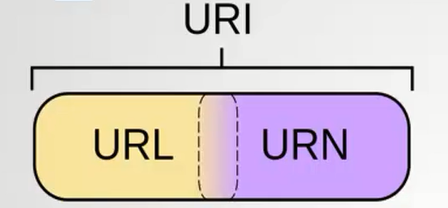
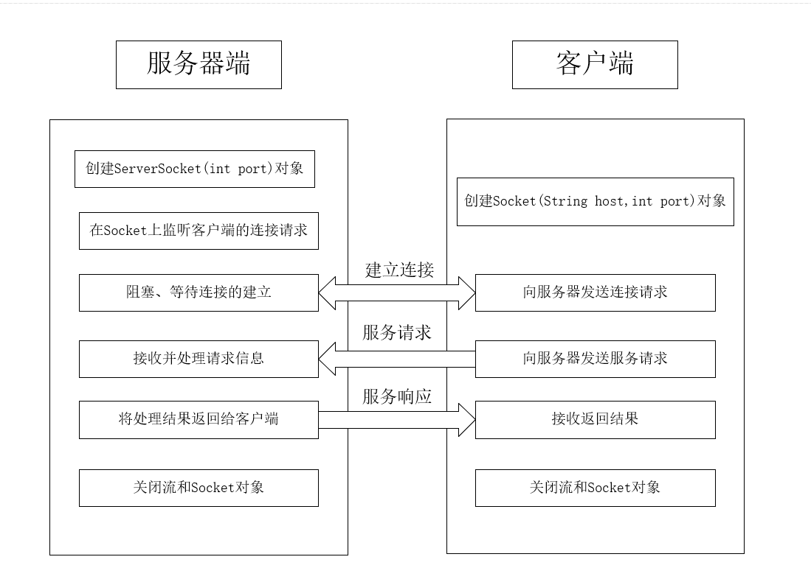

# Java基础学习笔记之网络编程

## 基本概念

网络：通讯协议、通信接口

网络三大基石：html、http、url

### OSI七层模型


### TCP/IP 五层模型


### IP

IPV4：32 位地址，以点分割的十进制表示

IPV6：128位（16个字节）写出8个16位正整数，每个正整数用四个十六位进制数表示，数之间用冒号表示

JAVA 中封装 IP

```java
// 通过 InetAddress.getLocalHost() 创建本机的 InetAddress 对象
InetAddress localHost = InetAddress.getLocalHost();
System.out.println("localHost: " + localHost);

System.out.println("Address: " + localHost.getAddress());
System.out.println("CanonicalHostName: " + localHost.getCanonicalHostName());
System.out.println("HostAddress: " + localHost.getHostAddress());
System.out.println("HostName: " + localHost.getHostName());

// 通过域名创建
InetAddress inetAddress = InetAddress.getByName("www.baidu.com");
// 通过 ip，port 创建
SocketAddress sa1 = new InetSocketAddress("127.0.0.1", 80);
// 通过 域名，port 创建
SocketAddress sa2 = new InetSocketAddress("www.baidu.com", 80);
System.out.println(sa1);
System.out.println(sa2);
```

### port

端口是 $2^{16}$

公认端口：0~1023

注册端口：1024~49151

动态/私有端口：49151~65535

### URI & URL & URN



URI: Uniform Resource Identifier，即统一资源标志符，用来唯一的标识一个资源。

URL: Uniform Resource Locator，统一资源定位符。即URL可以用来标识一个资源，而且还指明了如何获取这个资源。

URN: Uniform Resource Name，统一资源命名。即通过名字来表示资源的。

例如：http://www.simba1949.top/index.html#button

**http://**: 定义如何访问资源的方式。 

**www.simba1949.top/index.html#button** :是资源存放的位置。 

**#button**: 是资源。 

URI：http://www.simba1949.top/index.html#button

URL: http://www.simba1949.top/index.html

URN: www.simba1949.top/index.html#button

### URL

Java api

```java
URL url = new URL("https://image.baidu.com/search/index?tn=baiduimage&ipn=d&istype=2&ie=utf-8&oe=utf-8&word=%E7%AB%A5%E6%A2%A6#ref");
System.out.println("获取协议名: " +url.getProtocol());
System.out.println("获取域名或者IP: " + url.getHost());
System.out.println("获取端口: " + url.getPort());
System.out.println("请求资源带参数: " + url.getFile());
System.out.println("请求资源不带参数: " + url.getPath());

System.out.println("获取请求参数: " + url.getQuery());
System.out.println("获取锚点: " + url.getRef());
```

## 爬虫原理

```java
URL url = new URL("https://blog.csdn.net/simba1949");
HttpURLConnection urlConnection = (HttpURLConnection) url.openConnection();
// 设置请求方式
urlConnection.setRequestMethod("GET");
// 模拟浏览器
urlConnection.setRequestProperty("User-Agent", "Mozilla/5.0 (Windows NT 10.0; Win64; x64) AppleWebKit/537.36 (KHTML, like Gecko) Chrome/74.0.3729.131 Safari/537.36");
InputStream inputStream = url.openStream();
BufferedReader reader = new BufferedReader(new InputStreamReader(inputStream, "utf-8"));
int temp;
while ((temp = reader.read()) != -1){
    System.out.print((char)temp);
}
reader.close();
```

## Socket编程

我们开发的网络应用程序都属于应用层，TCP 和 UDP 属于传输层，在应用层和传输层之间，则是使用套接字（Socket）来进行分离和交流的

### 基于 TCP 编程

tcp 传输协议

一种面向连接的、可靠的、基于字节流的运输层通信协议

特点：

* 面向连接
* 点到点的通信
* 高可靠性
* 占用系统资源多、效率低

上层协议：http、ftp、smtp

#### Java 实现

详细步骤(通信原理)

> 1. 服务器创建 ServerSocket，在指定端口监听并处理请求
> 2. 客户端创建 Socket，向服务端发送请求



#### 一次请求单向发送

##### TCP 服务器

```java
package top.simba1949.socket.tcp;

import javax.sound.midi.Soundbank;
import java.io.DataInputStream;
import java.io.IOException;
import java.io.InputStream;
import java.net.ServerSocket;
import java.net.Socket;

/**
 * 创建服务器
 * 1. 指定端口，使用 ServerSocket 创建服务器
 * 2. 阻塞式等待连接 accept
 * 3. 操作：输入输出流操作
 * 4. 释放资源
 *
 * @author SIMBA1949
 * @date 2019/5/26 15:17
 */
public class TCPServer {
    public static void main(String[] args) throws IOException {
        // 1. 指定端口，使用 ServerSocket 创建服务器
        ServerSocket serverSocket = new ServerSocket(8888);
        // 2. 阻塞式等待连接 accept
        Socket accept = serverSocket.accept();
        System.out.println("一个客户端建立连接");
        // 3. 操作：输入输出流操作
        InputStream is = accept.getInputStream();
        DataInputStream dis = new DataInputStream(is);
        System.out.println(dis.readInt());
        System.out.println(dis.readUTF());
        // 4. 释放资源
        dis.close();
        serverSocket.close();
    }
}

```

##### TCP 客户端

```java
package top.simba1949.socket.tcp;

import java.io.DataOutputStream;
import java.io.IOException;
import java.io.OutputStream;
import java.net.Socket;

/**
 * 创建一个客户端
 * 1.使用 Socket 创建客户端，需要指定 服务地址 + 端口，建立连接
 * 2.操作：输入输出流操作
 * 3.释放资源
 *
 * @author SIMBA1949
 * @date 2019/5/26 15:21
 */
public class TCPClient {
    public static void main(String[] args) throws IOException {
        // 1.使用 Socket 创建客户端，需要指定 服务地址 + 端口，建立连接
        Socket client = new Socket("localhost", 8888);
        // 2.操作：输入输出流操作
        OutputStream os = client.getOutputStream();
        DataOutputStream dos = new DataOutputStream(os);
        dos.writeInt(9);
        dos.writeUTF("hello");
        dos.flush();
        // 3.释放资源
        os.close();
        dos.close();
        client.close();
    }
}

```

#### 一次请求双向交流

##### TCP 服务器

```java
c
```

##### TCP 客户端

```java
package top.simba1949.socket.tcp;

import java.io.*;
import java.net.Socket;

/**
 * @author SIMBA1949
 * @date 2019/5/26 15:53
 */
public class RequestAndResponseClient {
    public static void main(String[] args) throws IOException {
        // 1、指定地址和端口，创建 Socket 对象，此时已经建立连接
        Socket socket = new Socket("localhost", 8888);
        // 操作流：操作输入输出流
        OutputStream os = socket.getOutputStream();
        DataOutputStream dos = new DataOutputStream(os);
        BufferedReader reader = new BufferedReader(new InputStreamReader(System.in));
        System.out.print("请求输入用户名： ");
        String userName = reader.readLine();
        System.out.print("请求输入密码： ");
        String password = reader.readLine();
        dos.writeUTF("user=" + userName + "&pwd=" + password);


        InputStream is = socket.getInputStream();
        DataInputStream dis = new DataInputStream(is);
        System.out.println("获取服务器响应结果为： " + dis.readUTF());
        dos.close();
        os.close();
        dis.close();
        socket.close();
    }
}
```

### 基于 UDP 编程

一种无连接的传输协议，提供面向事务的简单不可靠信息传送服务

特点：

* 非面向连接、传输不可靠、可能丢失
* 发送不管对方有没有准备好，接收方收到也不确认
* 可以广播发送
* 非常简单地协议，开销小

上层协议：dns、snmp

#### Java 实现

DatagramSocket：用于发送或者接受数据包的套接字

DatagramPacket：数据包

#### UDP 协议接收方

```java
package top.simba1949.socket;

import java.io.IOException;
import java.net.DatagramPacket;
import java.net.DatagramSocket;

/**
 * 接收端
 * 1. 使用 DatagramSocket 指定端口，创建接收端
 * 2. 准备容器，封装成 DatagramPacket 包裹
 * 3. 阻塞式接受包裹 receiver(DatagramPacket dp)
 * 4. 分析数据
 *     byte[] getData()
 *     getLength()
 * 5. 释放资源
 *
 * @author SIMBA1949
 * @date 2019/5/26 11:42
 */
public class UDPClient {
	public static void main(String[] args) throws IOException {
		// 1. 使用 DatagramSocket 指定端口，创建接收端
		DatagramSocket datagramSocket = new DatagramSocket(9999);
		// 2. 准备容器，封装成 DatagramPacket 包裹，容器建议最多 1024 * 60
		byte[] container  = new byte[1024 * 60];
		DatagramPacket datagramPacket = new DatagramPacket(container, 0, container.length);
		// 3. 阻塞式接受包裹 receiver(DatagramPacket dp)
		datagramSocket.receive(datagramPacket);
		// 4. 获取真实数据，并分析数据
		byte[] receiver = datagramPacket.getData();
		int length = datagramPacket.getLength();
		System.out.println(new String(receiver, 0, length));
		// 5. 释放资源
		datagramSocket.close();
	}
}
```

#### UDP 协议发送方

```java
package top.simba1949.socket;

import java.io.IOException;
import java.net.*;

/**
 * 发送端
 * 1. 使用 DatagramSocket 指定端口，创建发送端
 * 2. 准备数据，一定要转换成**字节数组**
 * 3. 封装成 DatagramPacket 包裹，需要指定目的地
 * 4. 发送包裹 send(DatagramPacket dp)
 * 5. 释放资源
 *
 * @author SIMBA1949
 * @date 2019/5/26 11:42
 */
public class UDPServer {
	public static void main(String[] args) throws IOException {
		System.out.println("发送端启动中。。。。");
		//1. 使用 DatagramSocket 指定端口，创建发送端（ip和port）
		DatagramSocket datagramSocket = new DatagramSocket(8888);
		// 2. 准备数据，一定要转换成**字节数组**
		String data = "天道酬勤";
		byte[] bytes = data.getBytes();
		// 3. 封装成 DatagramPacket 包裹，需要指定目的地（ip 和 port）
		InetSocketAddress destAdd = new InetSocketAddress("localhost", 9999);
		DatagramPacket datagramPacket = new DatagramPacket(bytes, 0, bytes.length, destAdd);
		// 4. 发送包裹 send(DatagramPacket dp)
		datagramSocket.send(datagramPacket);
		//  5. 释放资源
		datagramSocket.close();
	}
}
```


